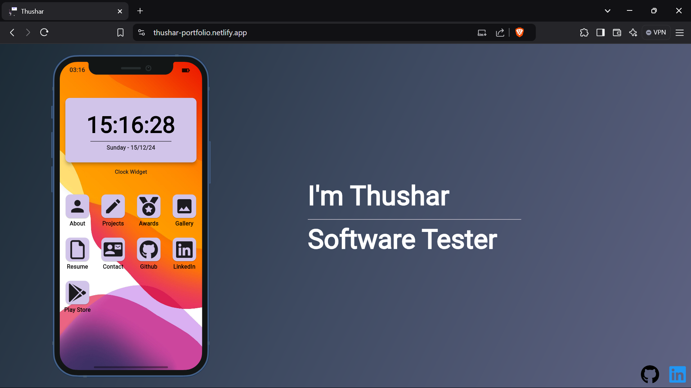

# My Personal Portfolio - Built with Flutter

Welcome to my personal portfolio! This web application is developed using [Flutter](https://flutter.dev/), showcasing my skills, projects, and experience as a developer. Feel free to explore the Website and check out my work!

## 🌐 Live Demo

You can view the live demo of my portfolio website here: [Live Demo](https://thushar-portfolio.netlify.app)

## 💻Screenshot


## 🛠️ Installation

To run this project locally, follow these steps:

### Prerequisites

- Flutter SDK (installed with web support)
- Dart SDK
- A modern web browser (Chrome, Firefox, etc.)

1. Clone the repository to your local machine:

    ```bash
    git clone https://github.com/Thushar2103/Personal_Portfolio.git
    ```

2. Navigate to the project directory:

    ```bash
    cd Personal_Portfolio
    ```

3. Install dependencies:

    ```bash
    flutter pub get
    ```

4. Run the app:

    ```bash
    flutter run
    ```


